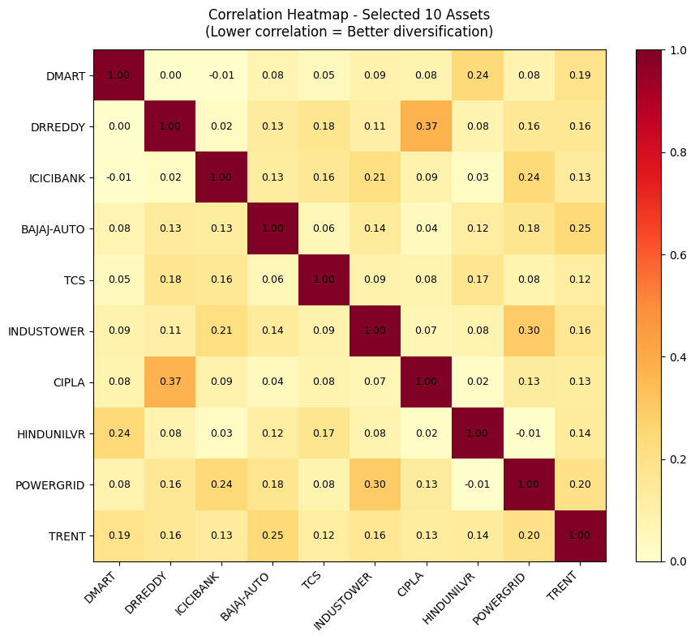
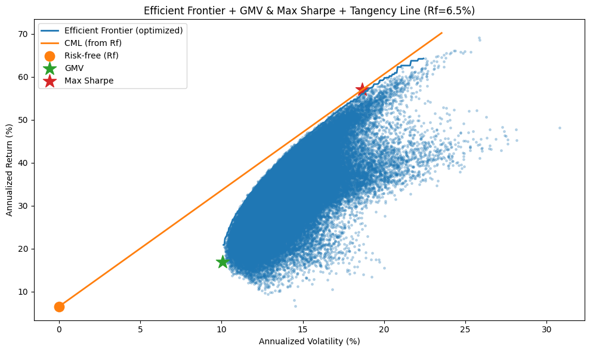
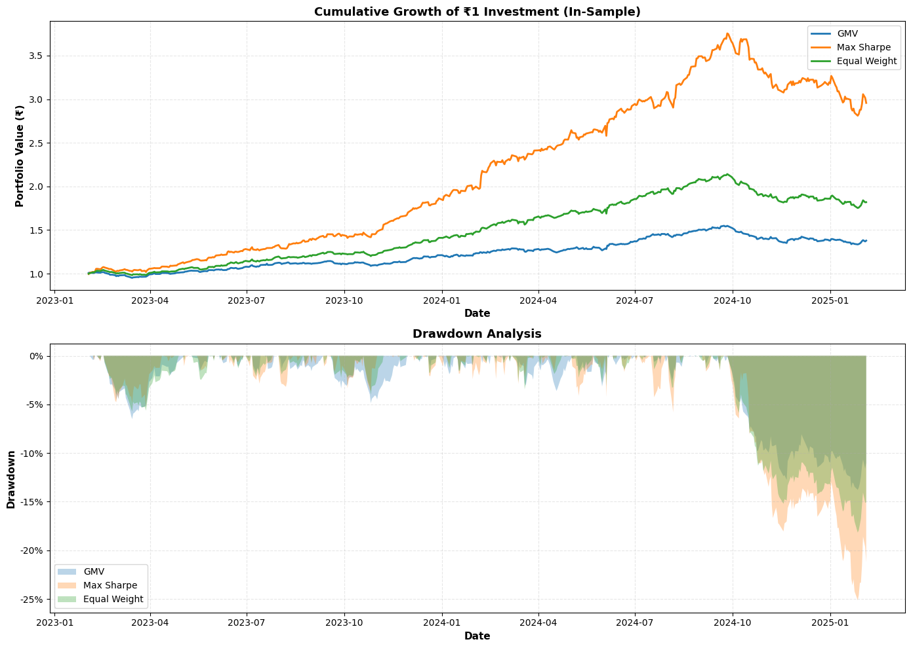
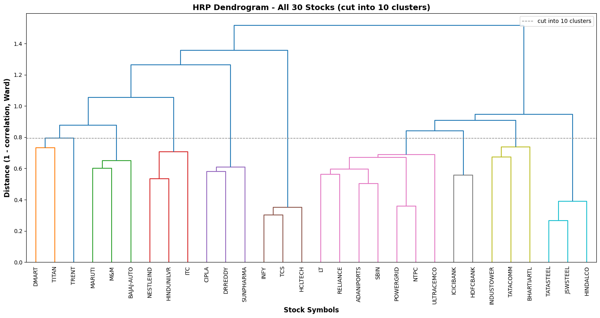

# Mean-Variance Portfolio Optimization (MPT) with Greedy & HRP Asset Selection

Construct a 10-asset, long-only portfolio from a 30-stock NSE universe using Modern
Portfolio Theory (MPT). The portfolio is optimized to maximize risk-adjusted return
subject to `w_i >= 0`, `sum(w_i) = 1`, and a risk-free rate `Rf = 6.5%`. A Monte Carlo
simulation generates the Efficient Frontier and identifies the **Global Minimum Variance
(GMV)** and **Maximum Sharpe** portfolios.

Two asset-selection strategies are compared:

1. **Greedy (least-correlated) selection** — pick the 10 stocks with the lowest average
   absolute correlation to maximize diversification.
2. **Hierarchical Risk Parity (HRP)** — cluster the 30-stock universe on its correlation
   structure and pick one diversified representative per cluster.

## Notebooks

| File | Description |
|------|-------------|
| `Greedy_Approach.ipynb` | Greedy least-correlated selection + Monte Carlo + in-sample / out-of-sample backtest |
| `HRP_Approach.ipynb` | HRP clustering selection + Monte Carlo + in-sample backtest |

## Procedure

1. **Universe & data.** 30-stock NSE universe of daily returns (739 trading days), split
   into train (495 days) and test (244 days, ~Feb 2025 – Jan 2026).
2. **Asset selection.**
   - *Greedy:* iteratively select the 10 stocks minimizing average absolute pairwise
     correlation.
   - *HRP:* build the correlation-distance matrix, perform hierarchical clustering, cut the
     tree into clusters, and select the best (highest-Sharpe / lowest-correlation)
     representative from each cluster.
3. **Optimization.** Run a Monte Carlo simulation over tens of thousands of long-only
   weight vectors to trace the Efficient Frontier and locate the GMV and Maximum-Sharpe
   portfolios (`Rf = 6.5%`, 252 trading days/yr). The HRP notebook additionally uses a
   Ledoit-Wolf-shrunk covariance for the simulation.
4. **Backtesting.** Evaluate GMV, Max-Sharpe, and Equal-Weight portfolios on the in-sample
   window (and out-of-sample for the Greedy notebook) using annualized return, volatility,
   Sharpe, Sortino, max drawdown, Calmar, win rate, and VaR/CVaR.

## Results

> All numbers below are taken directly from the notebook output cells.

### Greedy (Least-Correlated) Approach

**Selected 10 stocks:** DMART, DRREDDY, ICICIBANK, BAJAJ-AUTO, TCS, INDUSTOWER, CIPLA,
HINDUNILVR, POWERGRID, TRENT.

| Ticker | GMV weight | Max-Sharpe weight |
|--------|-----------:|------------------:|
| DMART | 0.0841 | 0.0156 |
| DRREDDY | 0.1249 | 0.0011 |
| ICICIBANK | 0.2313 | 0.1161 |
| BAJAJ-AUTO | 0.0439 | 0.2637 |
| TCS | 0.1793 | 0.0063 |
| INDUSTOWER | 0.0046 | 0.1039 |
| CIPLA | 0.0994 | 0.0539 |
| HINDUNILVR | 0.2101 | 0.0041 |
| POWERGRID | 0.0148 | 0.0506 |
| TRENT | 0.0076 | 0.3847 |

**Optimizer (annualized):** GMV — return 16.86%, volatility 10.08%. Max-Sharpe — return
56.98%, volatility 18.66%, Sharpe 2.71.

**Backtest (annualized):**

| Portfolio | Window | Return | Vol | Sharpe | Sortino | Max DD | Win Rate |
|-----------|--------|-------:|----:|-------:|--------:|-------:|---------:|
| GMV | In-sample | 17.76% | 10.08% | 1.049 | 1.806 | -13.79% | 54.95% |
| Max Sharpe | In-sample | 73.66% | 18.66% | 2.717 | 4.187 | -25.13% | 61.01% |
| Equal Weight | In-sample | 35.62% | 11.92% | 2.088 | 3.099 | -18.17% | 58.79% |
| GMV | Out-of-sample | -2.71% | 11.05% | -0.764 | -1.320 | -8.96% | 46.72% |
| Max Sharpe | Out-of-sample | -9.06% | 19.70% | -0.703 | -0.913 | -16.66% | 45.90% |
| Equal Weight | Out-of-sample | -3.00% | 12.58% | -0.680 | -1.048 | -10.00% | 44.67% |

### HRP (Hierarchical Risk Parity) Approach

The HRP algorithm discovered 10 clusters and selected one representative each:
BHARTIARTL, BAJAJ-AUTO, TRENT, ADANIPORTS, HINDALCO, ICICIBANK, TITAN, SUNPHARMA, HCLTECH,
NESTLEIND (10 clusters across 9 sectors; avg Sharpe 0.864, avg |corr| 0.232).

| Ticker | GMV weight | Max-Sharpe weight | Equal Weight |
|--------|-----------:|------------------:|-------------:|
| BHARTIARTL | 8.86% | 40.59% | 10.00% |
| BAJAJ-AUTO | 4.95% | 25.14% | 10.00% |
| TRENT | 0.13% | 15.47% | 10.00% |
| ADANIPORTS | 0.00% | 11.69% | 10.00% |
| HINDALCO | 1.53% | 4.16% | 10.00% |
| ICICIBANK | 23.04% | 0.03% | 10.00% |
| TITAN | 11.02% | 0.34% | 10.00% |
| SUNPHARMA | 20.08% | 1.00% | 10.00% |
| HCLTECH | 10.17% | 1.57% | 10.00% |
| NESTLEIND | 20.24% | 0.00% | 10.00% |

**Optimizer / in-sample backtest (annualized):**

| Portfolio | Return | Vol | Sharpe | Max DD | HHI (eff. N) |
|-----------|-------:|----:|-------:|-------:|-------------:|
| GMV | 21.90% | 11.20% | 1.262 | -16.51% | 0.167 (5.98) |
| Max Sharpe | 42.85% | 16.71% | 1.843 | -25.15% | 0.268 (3.74) |
| Equal Weight | 31.11% | 13.40% | 1.619 | -20.88% | 0.100 (10.00) |

Monte Carlo: 120,010 portfolios; Sharpe range 0.40–1.84. Covariance uses Ledoit-Wolf
shrinkage (intensity 0.057, condition number 8.38 vs 9.64 unshrunk). The HRP notebook ends
at the in-sample backtest (no out-of-sample window).

## Visualisations

### Correlation Heatmap — Greedy-Selected 10 Assets

*Near-zero off-diagonal values confirm the greedy selection achieves strong diversification across the 10 chosen stocks.*

### Efficient Frontier — GMV & Max-Sharpe (Greedy)

*Monte Carlo over thousands of long-only portfolios traces the efficient frontier; Max-Sharpe (red star) achieves Sharpe 2.72 in-sample.*

### Cumulative Growth & Drawdown — In-Sample Backtest

*Max-Sharpe significantly outperforms Equal-Weight in-sample; GMV shows the lowest drawdown reflecting its risk-minimization objective.*

### HRP Dendrogram — 30-Stock NSE Universe

*Ward linkage clustering cuts the 30-stock universe into 10 natural risk clusters; one diversified representative is selected per cluster.*

## Key Takeaways

- The Greedy (correlation-based) Max-Sharpe portfolio is excellent **in-sample**
  (Sharpe 2.72) but generalizes poorly — all three portfolios post negative Sharpe
  out-of-sample, the classic estimation-error / overfitting failure of plain mean-variance.
- HRP yields a more balanced, lower-concentration allocation (effective N up to ~6) and a
  smoother in-sample profile, motivating the regularization studied in the
  *Regularized-Covariance-Portfolio-Optimization* project.
