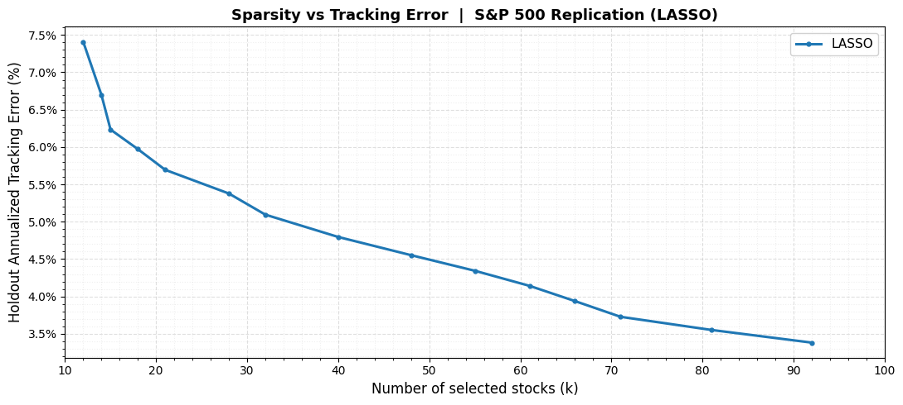
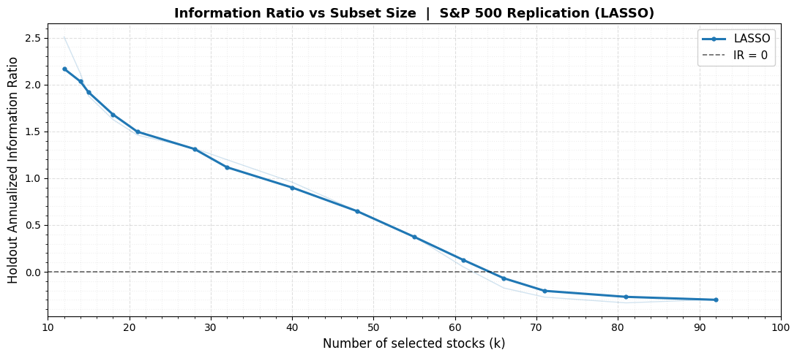
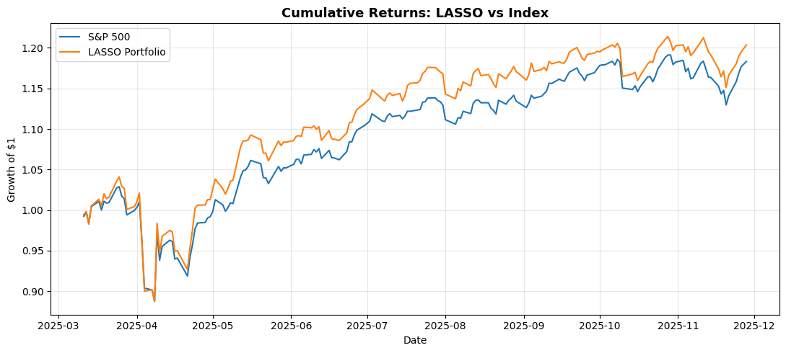

# Sparse S&P 500 Index Replication (Tracking Portfolio)

Synthetically replicate the daily return profile of the **S&P 500** using a strictly limited
subset of its constituents (`k ≤ 50`). Selecting exactly *k* of *N = 500* stocks to minimize
tracking variance is a Mixed-Integer Quadratic Program — NP-hard — so plain Markowitz
optimization does not apply; heuristic and regularized methods are required.

The objective is to minimize **Tracking Error**, the standard deviation of active returns:

```
TE = sqrt( Var(R_p − R_b) )
```

subject to a cardinality constraint `‖w‖₀ ≤ k` and `sum(w) = 1`, where `R_p` is the portfolio
return and `R_b` the benchmark (S&P 500) return.

**Five independent methodologies** are implemented and compared.

## Notebooks

| File | Method |
|------|--------|
| `lasso_tracking_portfolio_sp500.ipynb` | ℓ1-regularized (LASSO) regression replication |
| `autoencoder_tracking_portfolio_sp500.ipynb` | Deep autoencoder representative-stock selection |
| `genetic_algo_tracking_portfolio_sp500.ipynb` | Genetic algorithm under a cardinality constraint |
| `greedy_tracking_portfolio_sp500.ipynb` | Greedy forward selection (TE / Corr+Div / Beta variants) |
| `clustering_tracking_portfolio_sp500.ipynb` | K-Means & Affinity-Propagation clustering selection |

Data: daily OHLCV for S&P 500 constituents, Jan 2020 – Dec 2025. Train Jan 2020 – Jun 2025;
**holdout Jul 2025 – Dec 2025**. Returns `r_t = (P_t − P_{t-1})/P_{t-1}`, no look-ahead bias.

## Procedure (per method)

- **LASSO.** Solve `min ‖y − Xw‖²₂ + λ‖w‖₁` over a range of λ; each λ yields a different
  subset size *k*. Normalize weights to a fully invested portfolio; pick the λ with minimum
  holdout TE.
- **Autoencoder.** Train a fully-connected AE (`N→256→64→d` encoder, mirror decoder) on
  standardized returns. Score stocks by reconstruction communality, latent-factor
  contribution, and a hybrid; pick the top-*k*; estimate weights by regressing the benchmark
  on the selected stocks.
- **Genetic algorithm.** Represent each candidate as a binary selection vector with exactly
  *k* active stocks; fitness = −TE. Evolve via selection, crossover, mutation, and a repair
  step that enforces the cardinality constraint.
- **Greedy.** Forward-select stocks one at a time, re-estimating weights via regression each
  step, until *k* is reached. Three selection criteria: **TE** (minimize tracking error),
  **Corr+Div** (correlation vs diversification balance), **Beta** (match benchmark beta).
- **Clustering.** Build a return-statistics feature matrix (mean, vol, skew, kurtosis,
  day-of-week), reduce with t-SNE, then cluster with **K-Means** (one representative per
  cluster) or **Affinity Propagation** (auto-selects cluster count and exemplars); regress for
  weights.

Every method is swept across *k*, evaluated by tracking error, information ratio, and sector
allocation on both selection and holdout data, and reports the configuration with the lowest
holdout TE.

## Results

> All numbers below are taken directly from the notebook output cells. TE and IR are
> annualized; "holdout" = out-of-sample (Jul–Dec 2025).

### Per-method best configuration

| Method | Variant | Best k | Holdout TE | Holdout IR | Notes |
|--------|---------|-------:|-----------:|-----------:|-------|
| LASSO | — | 48 | 4.55% | 0.650 | α = 0.001366 |
| Autoencoder | Hybrid | 50 | 7.64% | -0.377 | score-based selection |
| Genetic Algorithm | — | 50 | 5.52% | 1.049 | Beta 0.766, R² 0.752 |
| Greedy | TE Min | 48 | **3.42%** | -0.858 | lowest TE |
| Greedy | Corr+Div | 50 | 5.97% | 1.582 | strong IR |
| Greedy | Beta | 50 | 5.68% | -0.320 | beta-aligned |
| Clustering | K-Means | 50 | 6.43% | **1.915** | highest IR |
| Clustering | Affinity Prop | 21 | 8.08% | -1.193 | auto cluster count |

### Selected highlights

- **LASSO (k=48).** Top holdings MSFT 0.112, AAPL 0.109, BRK-B 0.083, APH 0.070, AMZN 0.067.
  Sparsity-vs-TE curve runs from k=2 (TE 21.7%) to k=296 (TE 2.0%); k=48 gives TE 4.55% at
  IR 0.650 — the best balance of sparsity and stability.
- **Greedy TE (k=48).** Lowest holdout TE (3.42%) but negative IR (-0.858) → low error, poor
  risk-adjusted generalization. Top holdings BRK-B, MSFT, AAPL.
- **Genetic algorithm (k=50).** The only method printing beta/R²: TE 5.52%, Beta 0.766,
  R² 0.752, IR 1.049 — robust, consistent search.
- **K-Means (k=50).** Highest information ratio (1.915) at TE 6.43%; top holding GOOGL 0.126.

All methods exhibit sector bias — typically overweighting Technology and Financial Services
while underweighting defensive sectors (e.g., LASSO Technology 31.4% → 47.2%).

## Visualisations

### Sparsity vs Tracking Error — LASSO

*Clear sparsity-accuracy trade-off: TE falls from 7.4% at k=12 to 4.55% at k=48; beyond k≈70 gains diminish rapidly.*

### Information Ratio vs Subset Size — LASSO

*IR peaks at small k (sparse, high active return) and falls negative beyond k≈65 as over-replication erodes alpha; k=48 sits in the optimal zone.*

### Cumulative Returns: LASSO Portfolio vs S&P 500

*48-stock LASSO portfolio closely tracks and slightly outperforms the S&P 500 across the full holdout period (Jul–Dec 2025).*

## Key Takeaways

- There is a clear **sparsity ↔ tracking-error trade-off**: smaller *k* raises TE; larger *k*
  lowers it toward the full index.
- **No single method dominates.** Greedy-TE minimizes raw tracking error, clustering (K-Means)
  and Greedy Corr+Div maximize risk-adjusted performance (IR), and **LASSO offers the best
  overall balance** of sparsity, low TE, and positive IR.
- The autoencoder captures market structure but is the least precise tracker.
